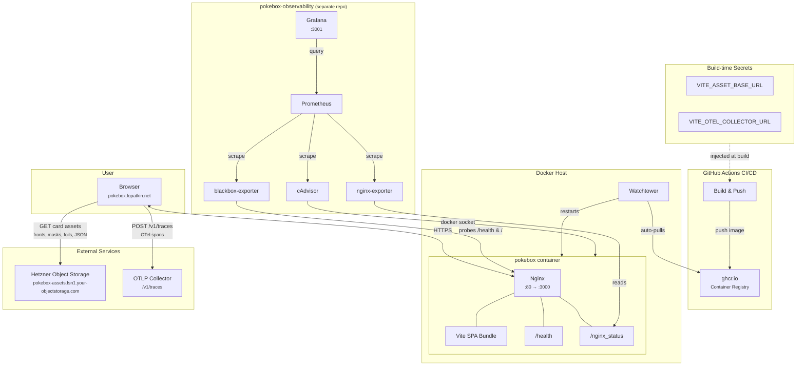
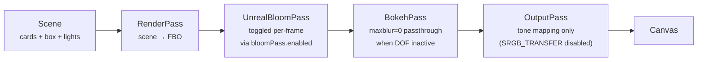
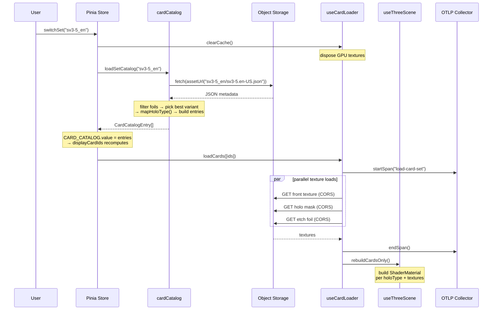
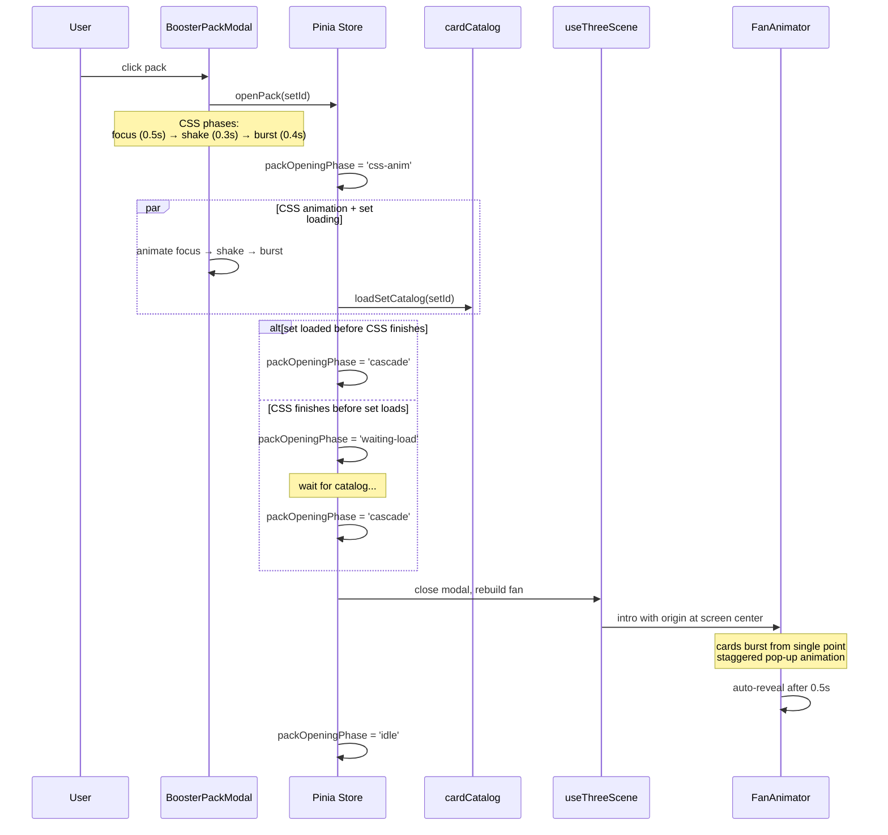
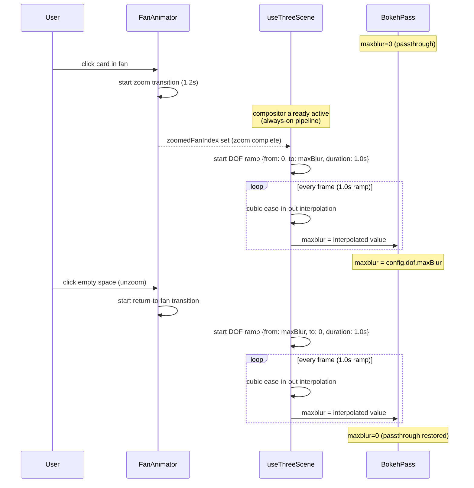

# Pokebox Architecture

## Browser App Internals

```mermaid
flowchart TB
    subgraph Vue["Vue 3 App"]
        App["App.vue"]
        Store["Pinia Store<br/><small>stores/app.ts</small>"]
        Search["CardSearch"]
        Booster["BoosterPackModal"]
        Toolbar["ToolbarButtons"]
        ShaderPanel["ShaderControlsPanel"]
        GfxPanel["GraphicsPanel<br/><small>tone mapping, DOF, bloom</small>"]
        CalPanel["CalibrationPanel<br/><small>webcam offset, lights</small>"]
        Instructions["InstructionsModal"]
        PerfOvl["PerfOverlay<br/><small>FPS, frame time</small>"]
        Toast["ToastContainer"]
    end

    subgraph Composables["Composables"]
        Scene["useThreeScene"]
        Loader["useCardLoader"]
        Face["useFaceTracking"]
        Tilt["useMouseTilt /<br/>useGyroscope"]
        Swipe["useSwipeGesture<br/><small>mobile vertical swipe</small>"]
        Fullscreen["useFullscreen"]
        UniformWatch["useUniformWatchers<br/><small>registry-driven<br/>config→uniform sync</small>"]
        Timers["useSceneTimers<br/><small>slideshow, carousel,<br/>hero lifecycle</small>"]
    end

    subgraph ThreeJS["Three.js Scene"]
        Camera["Off-axis Camera"]
        Box["Box Shell"]
        Cards["Card Meshes<br/><small>ShaderMaterial</small>"]
        Lights["Lights<br/><small>head-tracked spotlight</small>"]
        subgraph PostProc["Post-processing<br/><small>always-on EffectComposer</small>"]
            RP["RenderPass"]
            Bloom["UnrealBloomPass"]
            Bokeh["BokehPass<br/><small>maxblur=0 passthrough<br/>when DOF inactive</small>"]
            Output["OutputPass<br/><small>tone mapping only<br/>(no sRGB transfer)</small>"]
            RP --> Bloom --> Bokeh --> Output
        end
        subgraph SceneHelpers["Scene Helpers"]
            SceneBuilder["CardSceneBuilder<br/><small>layout dispatch</small>"]
            UniformUpd["ShaderUniformUpdater<br/><small>per-frame uniform push</small>"]
            FanAnim["FanAnimator<br/><small>intro, hover, zoom,<br/>fan-zoom DOF ramp</small>"]
            StackAnim["StackAnimator<br/><small>stack intro, swipe</small>"]
            Navigator["CardNavigator<br/><small>single-mode nav</small>"]
            Merge["MergeAnimator<br/><small>card transitions</small>"]
            FanLayout["FanLayoutBuilder"]
            StackLayout["StackLayoutBuilder"]
            CarouselLayout["CarouselLayoutBuilder"]
        end
    end

    subgraph Shaders["GLSL Shaders"]
        Vert["holo.vert"]
        Frag["*.frag<br/><small>14 shader variants</small>"]
        Common["common/*.glsl<br/><small>blend, filters, rainbow,<br/>holo-shine, base-adjust, voronoi</small>"]
        Frag --- Common
    end

    subgraph Data["Data Layer"]
        Catalog["cardCatalog.ts<br/><small>SET_REGISTRY +<br/>loadSetCatalog()</small>"]
        Hero["heroShowcase.ts<br/><small>cross-set hero cards</small>"]
        Defaults["defaults.ts<br/><small>DEFAULT_CONFIG,<br/>STARTUP_CARD_ID</small>"]
        AssetUrl["assetUrl()<br/><small>VITE_ASSET_BASE_URL</small>"]
        Registry["shaderRegistry.ts<br/><small>uniform↔config<br/>single source of truth</small>"]
    end

    subgraph External["External"]
        S3["Object Storage<br/><small>card assets</small>"]
        MediaPipe["MediaPipe CDN<br/><small>face_detection</small>"]
        Webcam["Webcam"]
        OTEL["OTLP Collector"]
    end

    subgraph Utils["Utils"]
        Spring["SpringValue<br/><small>physics-based damping</small>"]
        Perf["perfTracker<br/><small>FPS, draw calls</small>"]
    end

    subgraph Telemetry["Telemetry"]
        Tracer["OTel Tracer<br/><small>telemetry.ts</small>"]
    end

    %% User interactions
    Search -->|"selectCard(id)"| Store
    Booster -->|"switchSet(setId)"| Store
    Toolbar -->|"display mode, slideshow<br/><small>set/card selects hidden in carousel</small>"| Store
    ShaderPanel -->|"shader uniforms"| Store
    GfxPanel -->|"tone mapping, DOF, bloom"| Store
    CalPanel -->|"lights, webcam offset"| Store

    %% Store → Scene
    Store -->|"displayCardIds watcher"| Loader
    Store -->|"config watchers"| UniformWatch
    Store -->|"targetEye"| Scene
    Store -->|"timers"| Timers

    %% Catalog & asset loading
    Store -->|"switchSet()"| Catalog
    Store -->|"carouselHeroCatalog"| Hero
    Hero -->|"loadSetCatalog() per set"| Catalog
    Catalog -->|"fetch JSON"| AssetUrl
    Loader -->|"load textures"| AssetUrl
    AssetUrl -->|"GET (CORS)"| S3

    %% Face tracking pipeline
    Webcam -->|stream| Face
    Face -->|"dynamic import"| MediaPipe
    Face -->|"store.targetEye"| Store

    %% Tilt input
    Tilt -->|"rotateX/Y"| Scene
    Spring -->|"damped spring"| Tilt
    Swipe -->|"swipe up/down"| Scene

    %% Scene rendering
    Scene --> Camera
    Scene --> Box
    Scene --> Cards
    Scene --> Lights
    Scene --> PostProc
    Scene -->|"dispatch"| SceneBuilder
    SceneBuilder -->|"delegates"| FanLayout
    SceneBuilder -->|"delegates"| StackLayout
    SceneBuilder -->|"delegates"| CarouselLayout
    Scene -->|"tick()"| FanAnim
    Scene -->|"tick()"| StackAnim
    Scene -->|"tick()"| Navigator
    Scene -->|"tick()"| Merge
    Loader -->|"CardTextures"| Cards
    Cards --- Vert
    Cards --- Frag

    %% Uniform flow
    UniformWatch -->|"pushUniform()"| Cards
    Registry -->|"uniform defs"| UniformWatch
    Registry -->|"initial values"| Cards

    %% Telemetry
    Loader -->|"traced spans"| Tracer
    Tracer -->|"OTLP HTTP POST"| OTEL
    Scene -->|"frame stats"| Perf

    %% Animate loop
    UniformUpd -->|"uPointer, uTime<br/>uniforms per frame"| Cards
```

## Post-processing Pipeline

Every frame renders through the same `EffectComposer` FBO chain, initialized eagerly at startup. This ensures consistent lighting whether DOF, bloom, or tone mapping are active or not — no visual pop when effects toggle on/off.

**Why OutputPass without sRGB transfer:**

Three.js r182 skips per-material tone mapping when rendering to an FBO (`WebGLPrograms.js` checks `currentRenderTarget === null`). `OutputPass` is the only way to apply tone mapping in the compositor pipeline. However, card `ShaderMaterial` already outputs gamma-space sRGB directly in `gl_FragColor` — adding the sRGB transfer would double-gamma those pixels (milky washed-out look). Setting `renderer.outputColorSpace = LinearSRGBColorSpace` disables the sRGB transfer in `OutputPass`, so it applies tone mapping only.

**Fan-zoom DOF:**

When a card is clicked in fan mode, DOF ramps in gradually over 1 second (cubic ease-in-out), focusing on the zoomed card. On unzoom, DOF ramps back to 0 over 1 second. The `fanDofMaxBlur` / `fanDofRamp` state drives `BokehPass.uniforms.maxblur` each frame.

## Data Flow: Card Set Switch

## Data Flow: Booster Pack Opening

## Data Flow: Fan-Zoom DOF Transition

