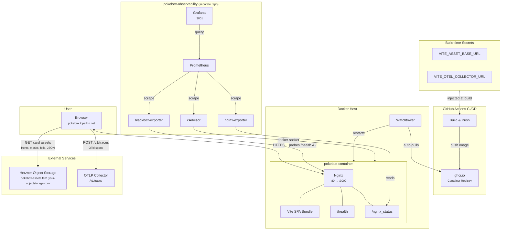
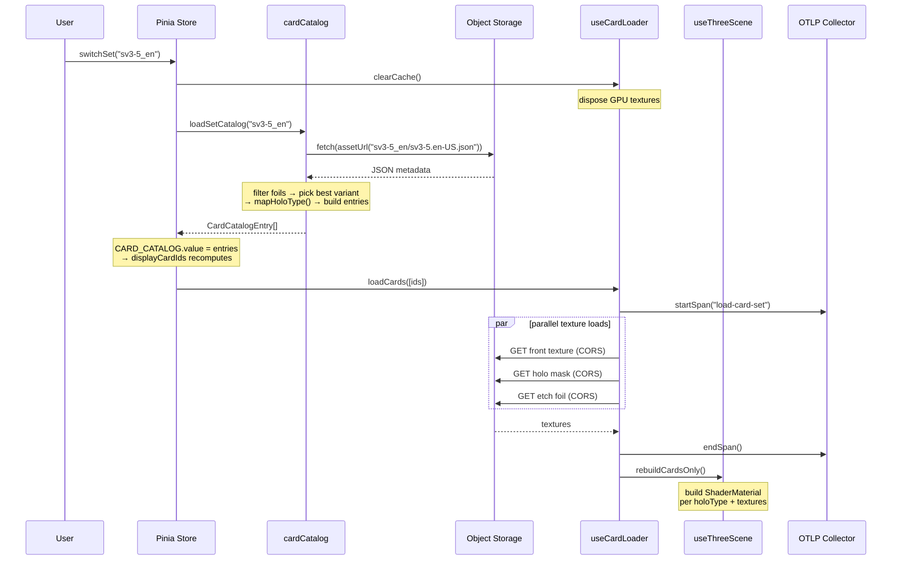

# Pokebox Architecture

```mermaid
flowchart TB
    subgraph User["User"]
        Browser["Browser<br/><small>pokebox.lopatkin.net</small>"]
    end

    subgraph CI["GitHub Actions CI/CD"]
        Build["Build & Push"]
        GHCR["ghcr.io<br/><small>Container Registry</small>"]
        Build -->|push image| GHCR
    end

    subgraph Secrets["Build-time Secrets"]
        S1["VITE_ASSET_BASE_URL"]
        S2["VITE_OTEL_COLLECTOR_URL"]
    end
    Secrets -.->|injected at build| Build

    subgraph Host["Docker Host"]
        subgraph Pokebox["pokebox container"]
            Nginx["Nginx<br/><small>:80 → :3000</small>"]
            SPA["Vite SPA Bundle"]
            Health["/health"]
            Stub["/nginx_status"]
        end
        Watchtower["Watchtower"] -->|auto-pulls| GHCR
        Watchtower -->|restarts| Pokebox
    end

    Browser <-->|HTTPS| Nginx
    Nginx --- SPA
    Nginx --- Health
    Nginx --- Stub

    subgraph External["External Services"]
        S3["Hetzner Object Storage<br/><small>pokebox-assets.fsn1.your-objectstorage.com</small>"]
        OTEL["OTLP Collector<br/><small>/v1/traces</small>"]
    end

    subgraph Monitoring["pokebox-observability <small>(separate repo)</small>"]
        Prometheus["Prometheus"]
        NginxExp["nginx-exporter"]
        Blackbox["blackbox-exporter"]
        cAdvisor["cAdvisor"]
        Grafana["Grafana<br/><small>:3001</small>"]

        Prometheus -->|scrape| NginxExp
        Prometheus -->|scrape| Blackbox
        Prometheus -->|scrape| cAdvisor
        Grafana -->|query| Prometheus
    end

    NginxExp -->|reads| Stub
    Blackbox -->|probes /health & /| Nginx
    cAdvisor -->|docker socket| Pokebox

    Browser -->|"GET card assets<br/><small>fronts, masks, foils, JSON</small>"| S3
    Browser -->|"POST /v1/traces<br/><small>OTel spans</small>"| OTEL
```

## Browser App Internals

```mermaid
flowchart TB
    subgraph Vue["Vue 3 App"]
        App["App.vue"]
        Store["Pinia Store<br/><small>stores/app.ts</small>"]
        Search["CardSearch"]
        Booster["BoosterPackModal"]
        Toolbar["ToolbarButtons"]
        ShaderPanel["ShaderControlsPanel"]
    end

    subgraph Composables["Composables"]
        Scene["useThreeScene"]
        Loader["useCardLoader"]
        Face["useFaceTracking"]
        Tilt["useMouseTilt /<br/>useGyroscope"]
        Swipe["useSwipeGesture<br/><small>mobile vertical swipe</small>"]
        UniformWatch["useUniformWatchers<br/><small>registry-driven<br/>config→uniform sync</small>"]
        Timers["useSceneTimers<br/><small>slideshow, carousel,<br/>hero lifecycle</small>"]
    end

    subgraph ThreeJS["Three.js Scene"]
        Camera["Off-axis Camera"]
        Box["Box Shell"]
        Cards["Card Meshes<br/><small>ShaderMaterial</small>"]
        Lights["Lights<br/><small>head-tracked spotlight</small>"]
        subgraph SceneHelpers["Scene Helpers"]
            UniformUpd["ShaderUniformUpdater<br/><small>per-frame uniform push</small>"]
            FanAnim["FanAnimator<br/><small>intro, hover, zoom</small>"]
            StackAnim["StackAnimator<br/><small>stack intro, swipe</small>"]
            FanLayout["FanLayoutBuilder"]
            StackLayout["StackLayoutBuilder"]
            CarouselLayout["CarouselLayoutBuilder"]
        end
    end

    subgraph Shaders["GLSL Shaders"]
        Vert["holo.vert"]
        Frag["*.frag<br/><small>9 holo types</small>"]
        Common["common/*.glsl<br/><small>blend, filters,<br/>rainbow, holo-shine</small>"]
        Frag --- Common
    end

    subgraph Data["Data Layer"]
        Catalog["cardCatalog.ts<br/><small>SET_REGISTRY +<br/>loadSetCatalog()</small>"]
        Hero["heroShowcase.ts<br/><small>cross-set hero cards</small>"]
        AssetUrl["assetUrl()<br/><small>VITE_ASSET_BASE_URL</small>"]
        Registry["shaderRegistry.ts<br/><small>uniform↔config<br/>single source of truth</small>"]
    end

    subgraph External["External"]
        S3["Object Storage<br/><small>card assets</small>"]
        MediaPipe["MediaPipe CDN<br/><small>face_detection</small>"]
        Webcam["Webcam"]
        OTEL["OTLP Collector"]
    end

    subgraph Telemetry["Telemetry"]
        Tracer["OTel Tracer<br/><small>telemetry.ts</small>"]
        Perf["perfTracker<br/><small>FPS, draw calls,<br/>load times</small>"]
    end

    %% User interactions
    Search -->|"selectCard(id)"| Store
    Booster -->|"switchSet(setId)"| Store
    Toolbar -->|"display mode, slideshow"| Store
    ShaderPanel -->|"shader uniforms"| Store

    %% Store → Scene
    Store -->|"displayCardIds watcher"| Loader
    Store -->|"config watchers"| UniformWatch
    Store -->|"targetEye"| Scene
    Store -->|"timers"| Timers

    %% Catalog & asset loading
    Store -->|"switchSet()"| Catalog
    Store -->|"carouselHeroCatalog"| Hero
    Hero -->|"loadSetCatalog() per set"| Catalog
    Catalog -->|"fetch JSON"| AssetUrl
    Loader -->|"load textures"| AssetUrl
    AssetUrl -->|"GET (CORS)"| S3

    %% Face tracking pipeline
    Webcam -->|stream| Face
    Face -->|"dynamic import"| MediaPipe
    Face -->|"store.targetEye"| Store

    %% Tilt input
    Tilt -->|"rotateX/Y"| Scene
    Swipe -->|"swipe up/down"| Scene

    %% Scene rendering
    Scene --> Camera
    Scene --> Box
    Scene --> Cards
    Scene --> Lights
    Scene -->|"tick()"| FanAnim
    Scene -->|"tick()"| StackAnim
    Loader -->|"CardTextures"| Cards
    Cards --- Vert
    Cards --- Frag

    %% Uniform flow
    UniformWatch -->|"pushUniform()"| Cards
    Registry -->|"uniform defs"| UniformWatch
    Registry -->|"initial values"| Cards

    %% Layout builders
    FanLayout -->|"build meshes"| Cards
    StackLayout -->|"build meshes"| Cards
    CarouselLayout -->|"build meshes"| Cards

    %% Telemetry
    Loader -->|"traced spans"| Tracer
    Tracer -->|"OTLP HTTP POST"| OTEL
    Scene -->|"frame stats"| Perf

    %% Animate loop
    UniformUpd -->|"uPointer, uTime<br/>uniforms per frame"| Cards
```

## Data Flow: Card Set Switch

```mermaid
sequenceDiagram
    participant User
    participant Store as Pinia Store
    participant Catalog as cardCatalog
    participant S3 as Object Storage
    participant Loader as useCardLoader
    participant Scene as useThreeScene
    participant OTel as OTLP Collector

    User->>Store: switchSet("sv3-5_en")
    Store->>Loader: clearCache()
    Note over Loader: dispose GPU textures
    Store->>Catalog: loadSetCatalog("sv3-5_en")
    Catalog->>S3: fetch(assetUrl("sv3-5_en/sv3-5.en-US.json"))
    S3-->>Catalog: JSON metadata
    Note over Catalog: filter foils → pick best variant<br/>→ mapHoloType() → build entries
    Catalog-->>Store: CardCatalogEntry[]
    Note over Store: CARD_CATALOG.value = entries<br/>→ displayCardIds recomputes

    Store->>Loader: loadCards([ids])
    Loader->>OTel: startSpan("load-card-set")

    par parallel texture loads
        Loader->>S3: GET front texture (CORS)
        Loader->>S3: GET holo mask (CORS)
        Loader->>S3: GET etch foil (CORS)
    end

    S3-->>Loader: textures
    Loader->>OTel: endSpan()
    Loader->>Scene: rebuildCardsOnly()
    Note over Scene: build ShaderMaterial<br/>per holoType + textures
```
